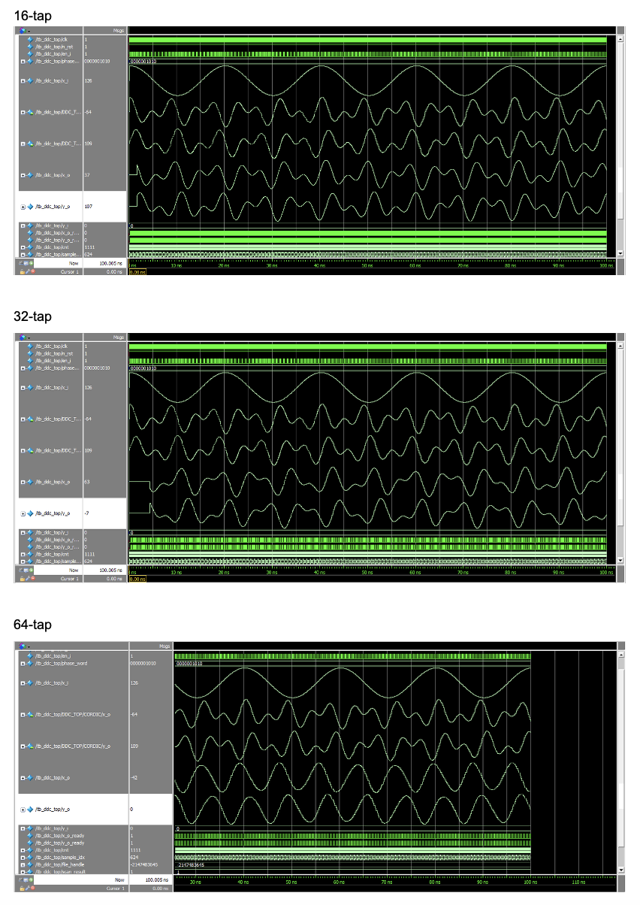
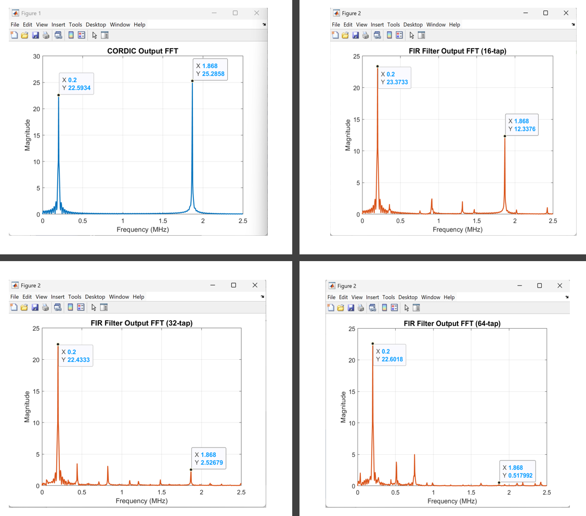

# Digital Down Converter (DDC)

## Contents
- [Introduction](#introduction)
- [Architecture](#architecture)
- [Getting Started](#getting-started)
- [Verification Methodology](#verification-methodology)
- [Result and Analysis](#result-and-analysis)
- [FPGA Resource Utilization](#fpga-resource-utilization-and-performance-analysis)
- [Conclusion](#conclusion)

## Introduction
A Digital Down Converter (DDC) is widely used in digital communication systems to convert a digitized input signal from an intermediate frequency (IF) to baseband. This frequency translation enables efficient digital signal processing by shifting the desired signal to a lower frequency range and suppressing unwanted frequency components through filtering.

In this project, a phase accumulator, a CORDIC-based digital mixer, and a parameterized FIR filter are used to implement the core functions of a DDC.

## Architecture
### Block Diagram

### Phase Accumulator
The phase accumulator generates a continuously increasing phase value by accumulating a phase increment. The generated phase returns to its initial value after completing a rotation and is used as the input angle for the CORDIC mixer. 

### CORDIC Mixer
The CORDIC mixer performs digital frequency translation by rotating the ADC input samples according to the phase information generated by the phase accumulator. It operates in rotation mode and performs vector rotation using iterative shift-and-add operations to generate the corresponding I/Q components without using multipliers.

The ADC input signal is applied as the in-phase component while the quadrature input is fixed to zero. After rotation, the mixer outputs the corresponding in-phase (I) and quadrature (Q) components:

I[n] = x[n]cos(θ[n])

Q[n] = x[n]sin(θ[n])

Quadrant mapping is performed before the iterative rotation process to support a full 360° phase range. The CORDIC algorithm is implemented using an 8-stage pipelined architecture, where each stage performs a fixed-angle rotation using shift-and-add operations.

### Parameterized FIR Filter
The I/Q outputs generated by the CORDIC mixer contain not only the desired down-converted signal but also unwanted frequency components introduced during the mixing process. Therefore, a low-pass FIR filter is applied to each I/Q channel to suppress unwanted frequency components while preserving the desired baseband signal. 

A previously developed parameterized FIR accelerator was used and filter coefficients are designed in MATLAB and converted into fixed-point representation for RTL implementation.
- FIR Accelerator: [https://github.com/JinELEC/FIR_Accelerator]

## Getting Started
### Requirements
- ModelSim 2020.1
- MATLAB R2024b - for FIR coefficients generation and FFT analysis
- Vivado 2022.1 - for synthesis and implementation
- FPGA: Xilinx Artix-7

### Repository Structure
''' 
├── rtl/
│   ├── ddc_top.sv              # Top-level DDC module
│   ├── phase_accumulator.sv    # Phase accumulator
│   ├── cordic.sv               # CORDIC-based digital mixer
│   └── fir.sv                  # Parameterized FIR filter
├── tb/
│   └── tb_ddc_top.sv           # Testbench for top-level DDC
└── docs/
    ├── adc_samples.txt         # Recorded ADC sample data used for verification
    └── ...                     # Diagrams and result images
'''

## Verification Methodology
The design was verified in two stages. First, the functionality of the DDC was validated using fixed ADC input samples and a fixed phase word. The generated I/Q outputs and filtered responses were analysed for different FIR tap configurations (16-, 32-, and 64-taps).

Second, the complete DDC was verified using recorded ADC sample data to evaluate the frequency response of the DDC. FFT analysis was performed using MATLAB to compare the attenuation of the desired signal and unwanted frequency components for each FIR filter configuration.

## Result and Analysis
### Test 1: Functional Verification

Comparison of ModelSim waveforms of the DDC using 16-, 32-, and 64-tap FIR filters with fixed ADC input value and a fixed phase word. 
The simulation results confirm correct operation of the DDC for different FIR tap configurations. Each component operates correctly after the pipelined latency.

### Test 2: DDC Verification Using Recorded ADC Samples

The ModelSim waveform shows the time-domain output of the DDC for different FIR tap configurations. As the number of FIR taps increases, the filtered output becomes smoother due to improved suppression of unwanted frequency components.

FFT analysis using MATLAB was then performed to evaluate the frequency response and attenuation of different FIR configurations.

### Frequency Attenuation Comparison 
| FIR Taps | 240 kHz | 440 kHz | 
|--------|-----|----|
| 16-tap | -0.207 dB | -0.620 dB | 
| 32-tap | -1.86 dB | -5.20 dB |
| 64-tap | -4.88 dB | -21.19 dB |

The 240 kHz component indicates the desired down-converted signal, while the 440 kHz component represents an unwanted frequency component. Increasing the number of FIR taps improves the attenuation of unwanted components.

## FPGA Resource Utilization and Performance Analysis
The hardware resource and performance were evaluated for different FIR filter tap configurations.

The results show the trade-offs between filtering performance, FPGA resource usage, power consumption, and maximum operating frequency. 
| FIR Taps | LUT | FF | DSP | Total Power | Fmax |
|--------|----|---|----|------------|-----|
| 16-tap | 860 | 771 | 8 | 0.12 W | 117.21 MHz |
| 32-tap | 1751 | 1302 | 32 | 0.172 W | 83.55 MHz |
| 64-tap | 4515 | 2304 | 128 | 0.345 W | 57.60 MHz |

As the number of taps increases, the hardware resource utilization and power consumption increase due to the increased number of DSPs and registers. However, a higher number of taps shows improved filtering performance with better attenuation of unwanted frequency components. 

The DDC using 16-tap FIR achieves the highest operating frequency and lowest resource usage, but shows limited attenuation. In contrast, 64-tap FIR shows better attenuation, operates at reduced frequency with increased hardware complexity. 

## Conclusion
The DDC architecture was successfully implemented using a phase accumulator, CORDIC-based digital mixer, and parameterized FIR filter. The design was verified through simulation and frequency-domain analysis, confirming correct frequency translation and attenuation.

The results demonstrate the trade-off between DDC with different FIR taps and FPGA resource utilization. Increasing the number of FIR taps improves attenuation performance but requires increased hardware complexity, higher power consumption, and reduced maximum operating frequency.
