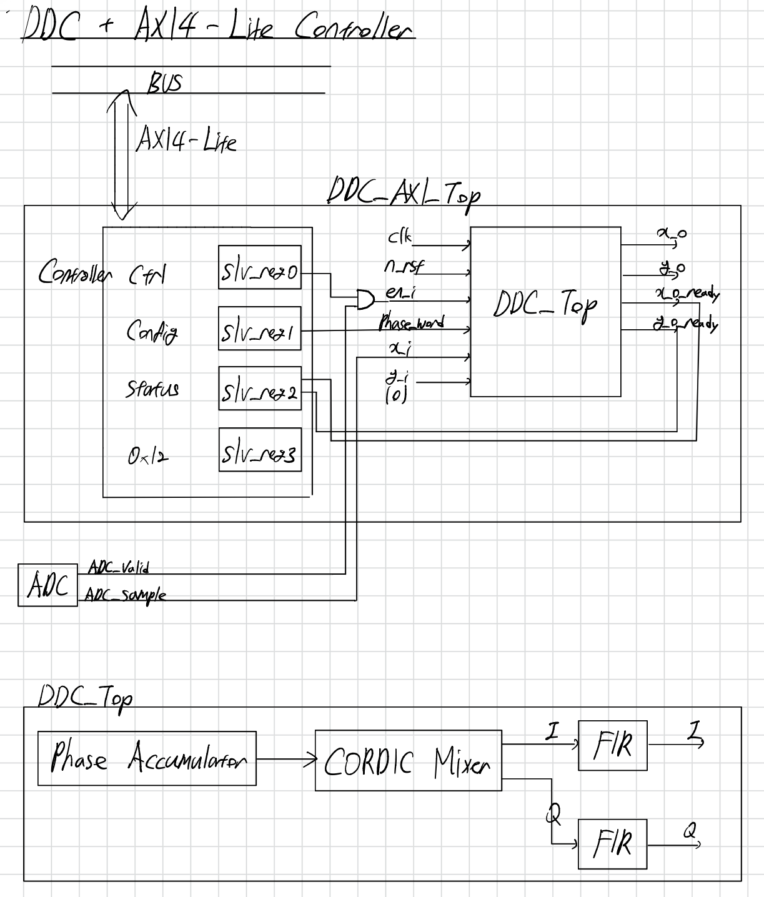
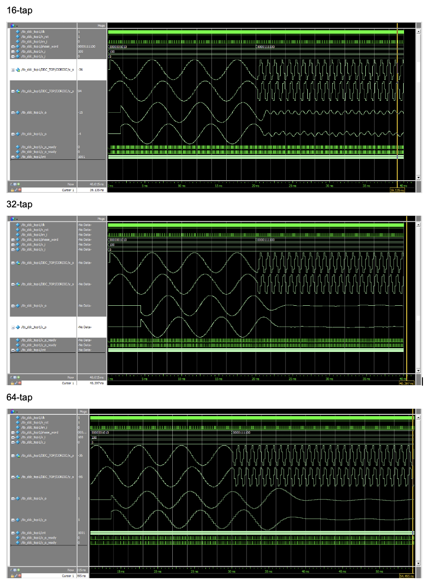
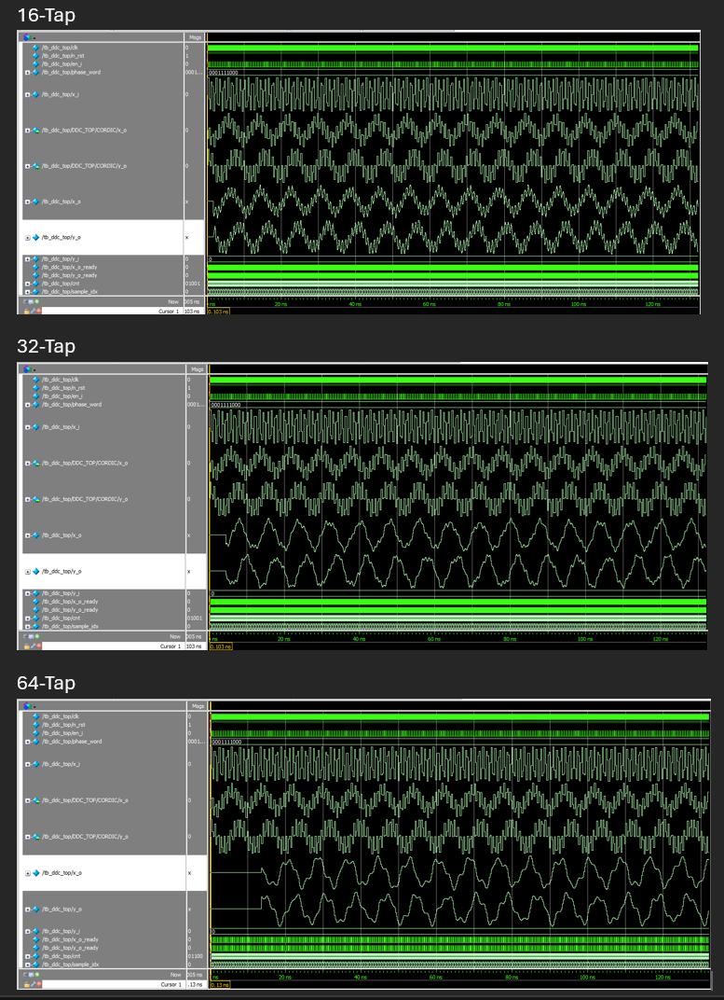
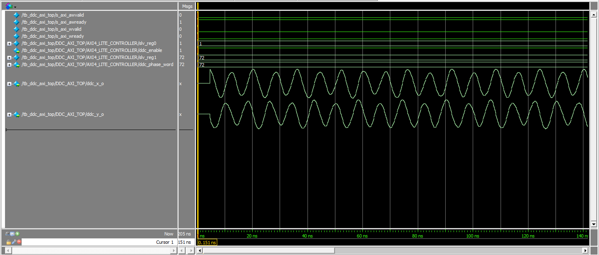

# AXI4-Lite Configurable DDC IP Core

## Contents
- [Introduction](#introduction)
- [Architecture](#architecture)
- [Getting Started](#getting-started)
- [Verification Methodology](#verification-methodology)
- [Result and Analysis](#result-and-analysis)
- [FPGA Resource Utilization](#fpga-resource-utilization-and-performance-analysis)
- [Conclusion](#conclusion)

## Introduction
A Digital Down Converter (DDC) is widely used in digital communication systems to convert a digitized input signal from an intermediate frequency (IF) to baseband. This frequency translation enables efficient digital signal processing by shifting the desired signal to a lower frequency range and suppressing unwanted frequency components through filtering.

In this project, a phase accumulator, a CORDIC-based digital mixer, a parameterized FIR filter, and an AXI4-Lite control interface are integrated to develop a configurable DDC IP.

The implemented DDC receives a 1.4667 MHz IF input signal sampled at 5 MSPS. A phase accumulator and CORDIC-based NCO generate a 1.6667 MHz digital local oscillator, translating the 1.4667 MHz to 200 kHz. The FIR filter then suppresses the unwanted 1.8667 MHz (due to aliasing of the 3.1333 MHz sum-frequency component). mixing component.

## Architecture
### Block Diagram


### Phase Accumulator
The phase accumulator generates a continuously increasing phase value by accumulating a phase increment. The generated phase returns to its initial value after completing a rotation and is used as the input angle for the CORDIC mixer. 

For the main verification:

- Sampling rate: 5 MSPS
- Phase word: 120°
- Phase sequence:
**0° → 120° → 240° → 0°**

Since the phase completes one full 360° rotation in five samples, the
generated digital LO frequency is:

**f_LO = 5 MHz / 3 ≈ 1.6667 MHz**


### CORDIC Mixer
The CORDIC mixer performs digital frequency translation by rotating the ADC input samples according to the phase information generated by the phase accumulator. 

The ADC input signal is applied as the in-phase component while the quadrature input is fixed to zero. After rotation, the mixer outputs the corresponding in-phase (I) and quadrature (Q) components:

I[n] = x[n]cos(θ[n])

Q[n] = x[n]sin(θ[n])

Quadrant mapping is performed before the iterative rotation process to support a full 360° phase range. The CORDIC algorithm is implemented using an 8-stage pipelined architecture, where each stage performs a fixed-angle rotation using shift-and-add operations.

For a 1.4667 MHz input signal and a 1.6667 MHz digital LO, the mixer produces:

**Difference frequency = |1.4667 MHz - 1.6667 MHz| = 0.2 MHz**

**Sum frequency = 1.4667 MHz + 1.6667 MHz = 3.1333 MHz**

Since the sum frequency (3.1333 MHZ) exceeds the Nyquist frequency (2.5 MHz), it is folded back:

**Aliased image frequency = 5 MHz - 3.1333 MHz = 1.8667 MHz**

The 200 kHz component is the desired down-converted signal, while the
1.8667 MHz component is suppressed by the FIR low-pass filter.

### Parameterized FIR Filter
The I/Q outputs generated by the CORDIC mixer contain not only the desired down-converted signal but also unwanted frequency components introduced during the mixing process. Therefore, a low-pass FIR filter is applied to each I/Q channel to suppress unwanted frequency components while preserving the desired baseband signal. 

A previously developed parameterized FIR accelerator was used and filter coefficients are designed in MATLAB and converted into fixed-point representation for RTL implementation.
- FIR Accelerator: [https://github.com/JinELEC/FIR_Accelerator]

Three FIR configurations are evaluated:
- 16-tap
- 32-tap
- 64-tap

These configurations are compared under the same sampling rate, input signal, phase word, and fixed-point scaling conditions for fair evaluation of filtering performance and hardware cost.

### AXI4-Lite Control Interface
An AXI4-Lite slave controller is integrated to enable software configuration of the DDC IP through memory-mapped registers. 
The controller decodes AXI write transactions and updates the configuration registers to set key parameters of DDC such as enable signal and phase word.

#### AXI4-Lite Register Map
| Address | Register | Description |
|---------|----------|-------------|
| 0x00 | CONTROL | Enable or disable the DDC |
| 0x04 | PHASE_WORD | Configure the phase word |
| 0x08 | STATUS | DDC output status |
| 0x0C | N/A | for extra work |

## Getting Started
### Requirements
- ModelSim 2020.1
- MATLAB R2024b (FIR coefficient generation and FFT analysis)
- Vivado 2022.1 
- FPGA: Xilinx Artix-7

### Repository Structure
``` 
├── rtl/
│   ├── ddc_axi_top.sv              # Top-level AXI4-Lite DDC IP
│   ├── axi4_lite_controller.sv     # AXI4-Lite slave controller
│   ├── ddc_top.sv                  # DDC datapath
│   ├── phase_accumulator.sv        # Phase accumulator
│   ├── cordic.sv                   # CORDIC-based mixer
│   └── fir.sv                      # Parameterized FIR filter
├── tb/
│   ├── tb_ddc_top.sv               # Testbench for DDC datapath
│   └── tb_ddc_axi_top.sv           # Testbench for AXI4-Lite DDC IP
├── matlab/
│   ├── fir_coefficients.m          # FIR coefficient generation
│   ├── adc_samples.m               # ADC input signal generation
│   └── fft_analysis.m              # FFT analysis
└── docs/
    ├── adc_samples.txt             # Generated/recorded ADC samples
    └── ...                         # Diagrams and result images
```

### Key Parameters
| Parameter | Value |
|---|---|
| Clock Frequency | 100 MHz |
| ADC Sampling Rate | 12.5 MSPS |
| Input Frequency | 3.0 MHz |
| Digital LO Frequency | 2.5 MHz |
| Phase Word | 72° |
| ADC Input Width | 8-bit signed |
| Phase Word Width | 10-bit |
| DDC Output Width | 16 / 32 / 64-bit (depends on FIR tap configuration) |
| FIR Tap Configurations | 16 / 32 / 64 |

## Verification Methodology
The design was verified in three stages. First, the functionality of the DDC was validated using fixed ADC input samples and a fixed phase word. The generated I/Q outputs and filtered responses were analysed for different FIR tap configurations (16-, 32-, and 64-taps).

Second, the complete DDC was verified using recorded ADC sample data to evaluate the frequency response of the DDC. FFT analysis was performed using MATLAB to compare the attenuation of the desired signal and unwanted frequency components for each FIR filter configuration.

Finally, the DDC with AXI4-Lite controller was verified by configuring through memory-mapped registers. AXI4-Lite write transactions were performed to update the enable signal and phase word. 

## Result and Analysis
### Test 1: Functional Verification

Comparison of ModelSim waveforms of the DDC using 16-, 32-, and 64-tap FIR filters with fixed ADC input value and a fixed phase word. 
The simulation results confirm correct operation of the DDC for different FIR tap configurations. Each component operates correctly after the pipelined latency.

### Test 2: DDC Verification Using Recorded ADC Samples

The ModelSim waveform shows the time-domain output of the DDC for different FIR tap configurations. As the number of FIR taps increases, the filtered output becomes smoother due to improved suppression of unwanted frequency components.


FFT analysis using MATLAB was then performed to evaluate the frequency response and attenuation of different FIR configurations.

### Frequency Attenuation Comparison 
| FIR Taps | 0.2 MHz | 1.868 MHz | 
|--------|-----|----|
| 16-tap | 0.295 dB | -6.23 dB | 
| 32-tap | -0.062 dB | -20.01 dB |
| 64-tap | 0.003 dB | -33.77 dB |

The 240 kHz component indicates the desired down-converted signal, while the 440 kHz component represents an unwanted frequency component. Increasing the number of FIR taps improves the attenuation of unwanted components.

### Test 3: AXI4-Lite Integration Verification


## FPGA Resource Utilization and Performance Analysis
The hardware resource and performance were evaluated for different FIR filter tap configurations.

The results show the trade-offs between filtering performance, FPGA resource usage, power consumption, and maximum clock frequency (Fmax). 
| FIR Taps | LUT | FF | DSP | Total On-Chip Power | Fmax |
|--------|----|---|----|------------|-----|
| 16-tap | 862 | 767 | 8 | 0.121 W | 116.66 MHz |
| 32-tap | 1218 | 1105 | 16 | 0.135 W | 103.52 MHz |
| 64-tap | 2607 | 1645 | 32 | 0.173 W | 80.76 MHz |

As the number of taps increases, the hardware resource utilization and power consumption increase due to the increased number of DSPs and registers. However, a higher number of taps shows improved filtering performance with better attenuation of unwanted frequency components. 

The DDC using 16-tap FIR achieves the highest operating frequency and lowest resource usage, but shows limited attenuation. In contrast, 64-tap FIR shows better attenuation, operates at reduced frequency with increased hardware complexity. 

### AXI4-Lite Integration Overhead
The hardware overhead due to the AXI4-Lite slave controller integration was analysed using the 32-tap FIR configuration.
| Configuration | LUT | FF | DSP | Total On-Chip Power | Fmax |
|---|---|---|---|---|---|
| 32-tap DDC | 1218 | 1105 | 16 | 0.135 W | 103.52 MHz |
| 32-tap DDC + AXI4-Lite | 1272 | 1181 | 16 | 0.140 W | 104.16 MHz |

The integration increases LUT and FF usage by approximately 2.9% and 6.1%, respectively, while DSP utilization remains unchanged. The total on-chip power and maximum operating frequency show negligible variation after integration.

## Conclusion
The integrated DDC architecture was successfully implemented using a phase accumulator, CORDIC-based digital mixer, parameterized FIR filter, AXI4-Lite controller. The design was verified through simulation, frequency-domain analysis, and integration verification, confirming correct frequency translation, signal attenuation, and register-based configuration.

The results demonstrate the trade-off between DDC with different FIR taps and FPGA resource utilization. Increasing the number of FIR taps improves attenuation performance but requires higher power consumption and reduced maximum clock frequency.
