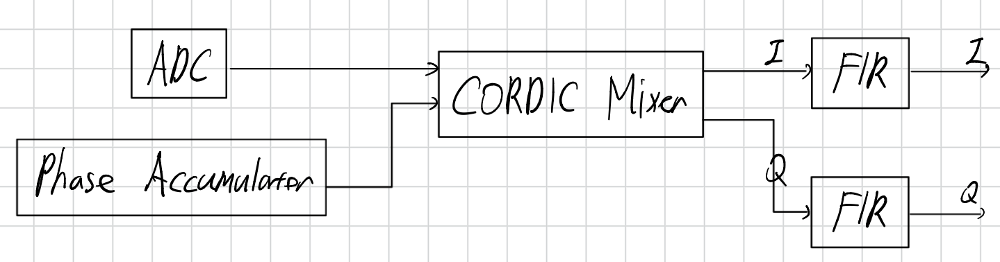
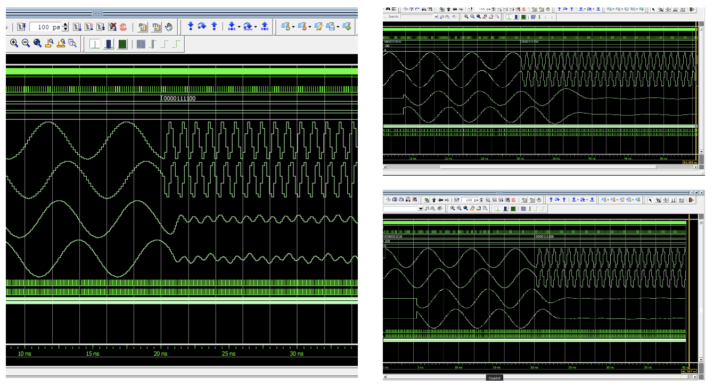

# Digital Down Converter (DDC)

## Introduction
A Digital Down Converter (DDC) is widely used in digital communication systems to convert a digitized input signal from an intermediate frequency (IF) to baseband. This frequency translation enables efficient digital signal processing by shifting the desired signal to a lower frequency range and suppressing unwanted frequency components through filtering.

In this project, a phase accumulator, a CORDIC-based digital mixer, and a parameterized FIR filter are used to implement the core functions of a DDC.

## Architecture
### Block Diagram

### Phase Accumulator
The phase accumulator generates a continuously increasing phase value by accumulating a phase increment. The generated phase returns to its initial value after completing a rotation and is used as the input angle for the CORDIC mixer. 

### CORDIC Mixer
The CORDIC mixer performs digital frequency translation by rotating the ADC input samples according to the phase information generated by the phase accumulator. It operates in rotation mode and performs vector rotation using iterative shift-and-add operations to generate the corresponding I/Q components without using multipliers.

The ADC input signal is applied as the in-phase component while the quadrature input is fixed to zero. After rotation, the mixer outputs the corresponding in-phase (I) and quadrature (Q) components:

I[n] = x[n]cos(θ[n])

Q[n] = x[n]sin(θ[n])

Quadrant mapping is performed before the iterative rotation process to support a full 360° phase range. The CORDIC algorithm is implemented using an 8-stage pipelined architecture, where each stage performs a fixed-angle rotation using shift-and-add operations.

### Parameterized FIR Filter
The I/Q outputs generated by the CORDIC mixer contain not only the desired down-converted signal but also unwanted frequency components introduced during the mixing process. Therefore, a low-pass FIR filter is applied to each I/Q channel to suppress unwanted frequency components while preserving the desired baseband signal. 

A previously developed parameterized FIR accelerator was used and filter coefficients are designed in MATLAB and converted into fixed-point representation for RTL implementation.
- FIR Accelerator: [https://github.com/JinELEC/FIR_Accelerator]

## Verification Methodology
The design was verified in two stages. First, the functionality of the DDC was validated using fixed ADC input samples and a fixed phase word. The generated I/Q outputs and filtered responses were analysed for different FIR tap configurations (16-, 32-, and 64-taps).

Second, the complete DDC was verified using recorded ADC sample data to evaluate the frequency response of the DDC. FFT analysis was performed using MATLAB to compare the attenuation of the desired signal and unwanted frequency components for each FIR filter configuration.

## Result and Analysis
### Test 1: Functional Verification

Comparison of ModelSim waveforms of the DDC using 16-, 32-, and 64-tap FIR filters with fixed ADC input value and a fixed phase word. 
The simulation results confirm correct operation of the DDC for different FIR tap configurations. Each component operates correctly after the pipelined latency.

### Test 2: Frequency-Domain Verification

